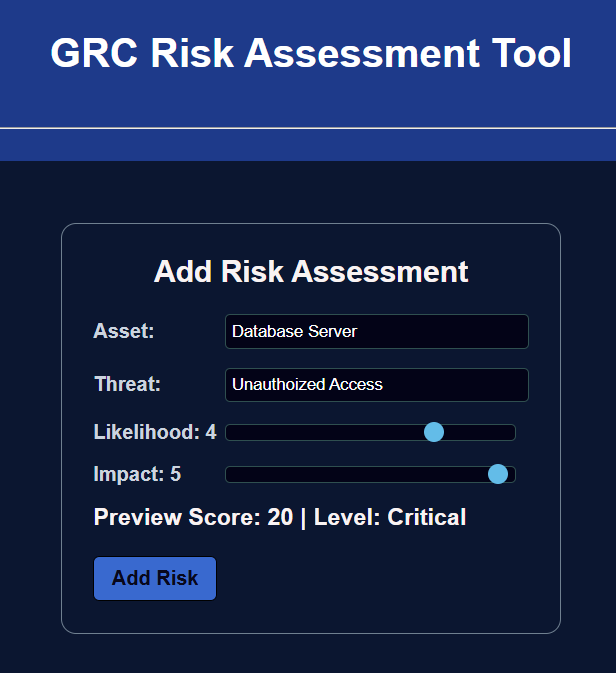
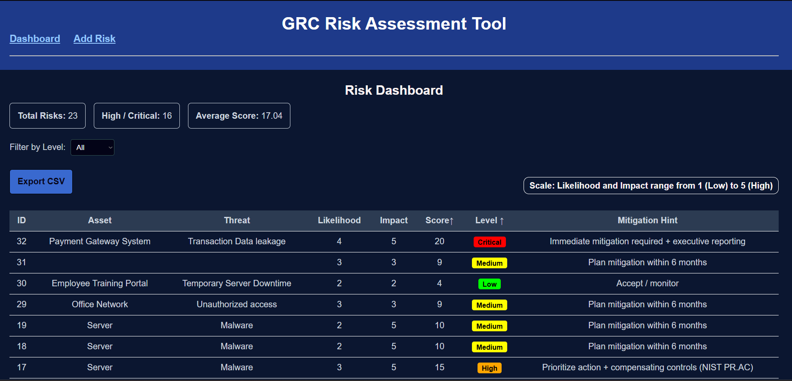

# GRC Risk Assessment & Heatmap Dashboard
A full-stack GRC risk assessment and visualization tool built using React, Flask, and SQLite3.

## Project Overview 
This project is a full-stack web application that represents a simplified version of Governance, Risk, and Compliance (GRC) risk assessment tool. The system allows users to add risks through a risk assessment form, calculate risk scores, determine risk levels, analyze mitigation strategies and visualize risks in tabular form on the dashboard page. Users can also visualize risks through a heatmap available on the dashboard page.

The goal of this project is to demonstrate how organizations track, identify and mitigate risks which may affect organizational systems and data security.

## Features
### Risk Assessment Form
- Users can enter asset name and threat description as inputs
- Sliders are present to help users to provide proper likelihood and impact values (1-5 range)
- Real-time preview of risk score and level 
- Input validations prevent empty or wrong input type submission
- Risk data is stored in backend database

### Dashboard
- Display all risks in a structured tabular form
- Sorting functionality based on risk score and risk level is present
- Filtering risks by severity level
- Stats cards display: 
    - Total number of risks
    - High / Critical risks
    - Average risk score
- Mitigation hints are displayed in table based on risk severity level
- CSV export functionality
- Interactive 5X5 risk heatmap with tooltip showing asset details
- Heatmap legend is provided to help users understand severity levels represented by colors


## GRC Context
Organizations use GRC (Governance, Risk, and Compliance) tools to identify and manage risk which can be harmful to their systems. These risks may include data breaches, malware attacks, unauthorized access, software vulnerabilities etc. These tools help security teams to understand how serious a risk is and what possible action should be taken to mitigate it.

This project supports GRC by allowing users to add risks, evaluate their severity levels, and analyze overall risk exposure. Risks are evaluated using a Likelihood X Impact matrix, which helps to calculate risk score and categorize the score's severity level. This matrix approach aligns with industry tools such as NIST SP 800-30 and ISO 27005, which use similar methods for risk assessment.

The dashboard and heatmap help to demonstrate how organizations monitor risks, identify high-priority threats, and plan mitigation strategies in a structured way.


## Tech Stack
### Frontend
    - React (Vite)
    - CSS
### Backend
    - Flask
    - SQLite3 

## Setup Instructions
### Clone Repository
    - git clone <my-repo-link>
    - cd grc-risk-tool-ahanamallik
### Backend Setup
    1. Navigate to backend folder
        cd backend
    2. Create virtual environment
        -- Windows
            python -m venv venv
            venv\Scripts\activate
        -- Mac/Linux
            python3 -m venv venv
            source venv/bin/activate
    3. Install dependencies
        pip install -r requirements.txt
    4. Run backend server
        python app.py
    Backend runs at
        http://127.0.0.1:5000
    Note
        Backend uses Flask-CORS to allow frontend requests from a different origin.

### Frontend Setup
    1. Navigate to frontend folder
        cd frontend
    2. Install dependencies
        npm install
    3. Run frontend
        npm run dev
    Frontend runs at
        http://localhost:5173
        
### Access the Application
Once both servers are running:
    - Open your browser and go to http://localhost:5173
    - The frontend will automatically connect to the backend
    - You can now start adding and managing risks.

### Environment Configuration
    1. Backend Configuration
        - Create a file named `.env` in backend folder
        - Add the following variable in that file:
            DB_NAME=risks.db
            PORT=5000
            DEBUG=True
    2. Frontend Configuration
        - Create a file named `.env` in frontend folder
        - Add the following variable:
            VITE_API_BASE_URL=http://127.0.0.1:5000
    3. Important Notes
        - `.env` files are excluded from version control for better security
        - Example configuration templates are provided as `.env.example` in both folders.

## Architecture Overview
The application follows a client-server architecture:
- React frontend handles UI rendering, risk input, and data visualization.
- Flask backend processes risk calculation, API handling, and database operations.
- SQLite3 stores risk records.
- REST APIs enable communication between frontend and backend.

## API Endpoints
### GET /risks
Fetch all stored risks from database.
Optional Query Parameter:
- level -> Filters risks based on severity level (Low, Medium, High, Critical)

Response:
- Returns a JSON list of risk objects.

---

### POST /assess-risk
Add a new risk entry to the database.

Example Request Body:
```JSON
{
    "asset": "Database Server",
    "threat": "Unauthorized access",
    "likelihood": 3,
    "impact": 4
}
```

## Usage
    - Add risk details using the risk assessment form
    - View and analyze risks in the dashboard
    - Filter risks based on risk level
    - Sort risks based on risk score or risk level
    - Use the heatmap for risk visualization
    - Export risk data as CSV

## Testing
Manual testing was performed by adding multiple risks across different severity levels. The following scenarios were verified thoroughly: 
    - Checked that empty inputs were not added to the risk table
    - Confirmed that risk score and level preview worked properly
    - Verified that risk score calculations were accurate
    - Verified that stats cards displayed accurate values
    - Checked that categorization of risks into different levels was accurate
    - Verified that filtering correctly displayed risk data based on selected level
    - Checked that sorting functionality worked properly for both score and level
    - Verified that heatmap counts matched dashboard data
    - Confirmed that tooltip showed correct asset details while hovering over heatmap cell
    - Verified that CSV report functionality generated correct risk reports
    - Verified heatmap legend correctly represented risk level colors
Testing confirmed that application behaved as expected across different input combinations.

## Screenshots
### Risk Assessment Form

*Data entry with real-time score and severity preview*

### Dashboard

*Risks data in tabular form + filtering + Export CSV button + Mitigation strategies*

### Heatmap visualization

*Risk data visualization and asset details in tooltip*


## Challenges Faced
### Issue with GET API not returning the data
While testing the APIs through Postman, I noticed that GET API was returning an empty list even though the POST API was saving data successfully. To verify this, I opened the SQLite3 database and confirmed that new risk records were being stored correctly. Then I reviewed my GET API code and logic looked correct to me. So I realized the issue was related to backend server start and restarting the server fixed the problem. This experience helped me understand how server state can affect data retrieval.

### Issue with CORS Blocking API Requests
While connecting the React frontend with the Flask backend, API requests from the frontend were getting blocked and the dashboard was not able to fetch data from database. After checking the browser console, I noticed CORS-related error messages and I remembered that this usually happens when frontend and backend run on different ports. So I resolved the issue by enabling CORS in the Flask backend using Flask-CORS library. This ensured proper communication with the frontend and backend.

### Improving Git Repository Structure
While organizing the project repository, I noticed some local files, such as the database file and env file, were being tracked in version control. Since these files are system-specific and change frequently, so including them could increase repository size and create issues when sharing the project. To resolve this, I updated the .gitignore file to exclude these files. This helped me to understand the importance of managing a clean, well structured repository.

### Issue with Repeated API Calls during Data Fetching
While developing the dashboard, I initially tried to call the data-fetching function (fetchRisks()) function directly in the component, which caused an infinite number of API calls. This happened because every time the data was fetched, state was updated which triggered the component to re-render and call the function repeatedly. I resolved this problem by realizing that useEffect hook is needed to control the function calling. So I moved the function within useEffect and added filterLevel in dependency array for controlling data fetching and filtering. This issue helped me understand how React handles rendering and side effects and I realized the importance of useEffect hook.

### Issue with Heatmap Data and Alignment
While implementing the heatmap, I faced difficulty in correctly displaying risk counts based on likelihood and impact combinations. I resolved this by using filtering logic for each cell to calculate risk counts and using map to display the asset details. I also faced a table alignment problem where impact columns were not properly aligned with likelihood rows. Later I realized that an empty <th> was needed to fix the problem. Adding the empty <th> fixed the issue. It helped me understand data visualization logic.

### Issue with CSV Export Implementation
While implementing the CSV export functionality, I faced difficulty in converting dashboard risk data into proper CSV format. Initially, it was challenging for me to structure the data with headers and rows correctly, but I resolved it by creating a header array and mapping the risk data into row format and then combined them into a CSV string. I also learned how to implement file downloading functionality using Blob. This helped me to understand how data can be converted into downloadable file formats.

## Assumptions
- Login and user roles are not included in this project. I assumed this tool will be used by a single team, so I did not implement login and role-based access.

- The application is mainly designed for testing purposes, so I assumed only one user will use it at a time

- Risk scores are calculated using fixed score ranges (1-5) based on likelihood X Impact method.

- I used SQLite3 database because it is easy to integrate with python and suitable for small-scale applications, so I decided SQLite3 would be sufficient to handle it.

## Future Enhancements
- Add login systems so that multiple users can use this tool securely.
- Add MySQL or PostgreSQL for handling multiple user login functionality because SQLite3 can lock database from others while one user accessing it.
- Add search bar option in dashboard to help users retrieve specific risks easily.
- Improve mobile view so that application works properly on smaller screens.

## License
This project is licensed under the MIT License.